# Fix #3 — Live Data Pipeline & Dashboard Integration Report

## Summary

This report documents the implementation of live data pipelines, assessment-to-report flow, routine tracking, and dashboard integration for AuraSkin AI. All dashboard metrics now come from database queries; mock data has been removed from user, admin, and partner dashboards.

---

## 1. Files Modified

### Backend

| File | Change |
|------|--------|
| `backend/src/modules/user/services/dashboard-metrics.service.ts` | **Created.** Computes `skinHealthIndex`, `weeklyProgress`, `routineAdherence`, `reportsCount`, `recommendedProducts` from `reports`, `routine_logs`, `recommended_products`. |
| `backend/src/modules/user/services/report.generator.ts` | **Created.** Rule-based report generation (acne, pigmentation, hydration, skin_condition, recommended_routine). |
| `backend/src/modules/user/services/routine.service.ts` | **Created.** Current routine plan, adherence, logs, upsert log. |
| `backend/src/modules/user/repositories/routine.repository.ts` | **Created.** CRUD for `routine_plans`. |
| `backend/src/modules/user/repositories/routineLogs.repository.ts` | **Created.** CRUD for `routine_logs`. |
| `backend/src/modules/user/controllers/routine.controller.ts` | **Created.** `GET /user/routines/current`, `GET /user/routines/logs`, `POST /user/routines/logs`. |
| `backend/src/modules/user/dto/routine-log.dto.ts` | **Created.** DTOs for routine log create/query. |
| `backend/src/modules/user/user.controller.ts` | **Updated.** Injected `DashboardMetricsService`, added `GET /user/dashboard-metrics`. |
| `backend/src/modules/user/user.module.ts` | **Updated.** Registered `DashboardMetricsService`, `RoutineService`, `RoutineController`, `RoutineRepository`, `RoutineLogsRepository`; removed duplicate provider. |
| `backend/src/modules/user/services/report.service.ts` | **Updated.** Uses `ReportGenerator`, `RoutineRepository`, `generateRoutinePlan`; creates routine plan after report. |
| `backend/src/modules/admin/services/analytics.service.ts` | **Updated.** Added `total_products` (count from `products` table). |
| `backend/src/database/models/index.ts` | **Updated.** Added `DbRoutinePlan`, `DbRoutineLog`, `RoutineLogTimeOfDay`, `RoutineLogStatus`. |
| `backend/src/modules/ai/routine-engine.ts` | **Created.** Rule-based routine engine: `RoutineEngineInput` → `RoutinePlanOutput` (morningRoutine, nightRoutine, lifestyle). |

### Frontend

| File | Change |
|------|--------|
| `frontend/web/src/services/api.ts` | **Updated.** Added `getUserDashboardMetrics`, `getUserCurrentRoutine`, `getUserRoutineLogs`, `createUserRoutineLog`, `getReportWithRecommendations`; types for metrics and routine. |
| `frontend/web/src/services/apiAdmin.ts` | **Updated.** Added `getAdminAnalytics()`, `AdminAnalytics` (including `total_products`). |
| `frontend/web/src/services/apiPartner.ts` | **Updated.** `getPartnerAnalytics` now calls `GET /partner/store/analytics` and maps backend response to `PartnerAnalytics`; removed local orders/products aggregation. |
| `frontend/web/src/hooks/useDashboardJourney.ts` | **Updated.** Accepts optional `metrics` and `routineSummary`; `healthScore` and `healthScoreDelta` from metrics (no hard-coded 78/5). |
| `frontend/web/src/app/(app-shell)/(user)/dashboard/page.tsx` | **Updated.** Fetches `getUserDashboardMetrics`, `getUserCurrentRoutine`, `getUserRoutineLogs`, `getReportWithRecommendations`; passes metrics and routine to journey hook; routine grid from API logs; toggle calls `createUserRoutineLog`; empty state copy when no assessment; passes recommended products/derms to `AIRecommendationsSection`. |
| `frontend/web/src/app/(app-shell)/(admin)/admin/page.tsx` | **Updated.** Uses `getAdminAnalytics()` and `getPendingInventory()` for all counts and revenue; activity timeline shows empty state. |
| `frontend/web/src/app/(app-shell)/(admin)/admin/analytics/page.tsx` | **Updated.** Uses `getAdminAnalytics()` for cards and revenue; removed placeholder charts. |
| `frontend/web/src/components/dashboard/AIRecommendationsSection.tsx` | **Updated.** Removed `MOCK_RECOMMENDED_PRODUCTS` and `MOCK_DERM_INSIGHTS`; accepts `recommendedProducts` and `recommendedDermatologists` props; renders live data. |
| `frontend/web/src/components/layouts/AppShellLayout.tsx` | **Updated.** `isPanel` only true for `pathname === "/store"` or `pathname.startsWith("/store/")` or `pathname === "/dermatologist"` or `pathname.startsWith("/dermatologist/")` so `/stores` and `/dermatologists` (user routes) keep the navbar. |

---

## 2. APIs Created / Extended

| Method | Path | Description |
|--------|------|-------------|
| GET | `/api/user/dashboard-metrics` | Returns `skinHealthIndex`, `weeklyProgress`, `routineAdherence`, `reportsCount`, `recommendedProducts` for the authenticated user. |
| GET | `/api/user/routines/current` | Returns current routine plan and adherence summary (percent last 7 days, current streak). |
| GET | `/api/user/routines/logs` | Returns logs for the current plan (query `?days=7`). |
| POST | `/api/user/routines/logs` | Body: `{ date, timeOfDay: "morning" \| "night", status: "completed" \| "skipped" }`. Creates or updates a log entry. |
| GET | `/api/admin/analytics` | Already existed; now includes `total_products`. |
| GET | `/api/partner/store/analytics` | Already existed; frontend now calls it for store analytics instead of computing from orders/products client-side. |

---

## 3. DB Queries Used

### User dashboard metrics (`DashboardMetricsService.getMetrics`)

- **reports:** `reports` where `user_id = ?`, order by `created_at` desc; count and latest row for scores and `recommended_products` count.
- **recommended_products:** count from `recommended_products` where `report_id = latestReport.id`.
- **routine_logs:** count from `routine_logs` where `user_id = ?`, `date >= weekAgo`, `status = 'completed'` for adherence.

### Skin health index

- Derived from latest report: `acne_score`, `pigmentation_score`, `hydration_score` combined (e.g. `(1-acne)*33 + (1-pig)*33 + hyd*34`), clamped 0–100.
- **Weekly progress:** comparison with previous report’s same formula when available.

### Routine (current + logs)

- **routine_plans:** latest by `user_id`, order `created_at` desc.
- **routine_logs:** by `user_id`, `routine_plan_id`, optional `date >= fromDate`; upsert by `(user_id, routine_plan_id, date, time_of_day)`.

### Admin analytics

- Counts: `profiles`, `store_profiles`, `dermatologist_profiles`, `orders`, `products`.
- **total_revenue:** sum of `orders.total_amount` where `order_status != 'cancelled'`.

### Store analytics (partner)

- Orders for `store_id` in completed statuses; `order_items` for product aggregates; `products` for names; monthly grouping for `monthly_sales`.

---

## 4. Dashboard Metrics Logic

- **User dashboard (no assessment):** `skinHealthIndex = 0`, `weeklyProgress = 0`, `reportsCount = 0`; copy: “No assessment yet — start your first skin check.”
- **User dashboard (with reports):** Metrics from `GET /user/dashboard-metrics`; journey hook uses `metrics.skinHealthIndex`, `metrics.weeklyProgress`, and routine summary for streak/percent.
- **Admin dashboard:** All cards from `GET /admin/analytics` (`total_users`, `total_stores`, `total_dermatologists`, `total_orders`, `total_revenue`, `total_products`); pending count from `getPendingInventory()`.
- **Partner store analytics:** `GET /partner/store/analytics`; response mapped to `revenueData`, `ordersTrend`, `topProducts`; conversion/customer retention set to 0 when not provided by backend.

---

## 5. AI Pipeline Steps (Assessment → Report)

1. **POST /api/user/assessment** — Create assessment row.
2. **POST /api/user/assessment/upload** — Upload images to storage.
3. **POST /api/user/assessment/submit** — Validate images, enqueue AI job (Redis), set assessment status to `queued`/`processing`.
4. **Worker** — Picks job; optional face validation (e.g. “Please upload a clear face image” on failure); runs analysis; calls backend to create report.
5. **Report creation (backend):** `ReportGenerator.generateFromAssessment` → insert `reports`; product/dermatologist recommendations; `generateRoutinePlan` → insert `routine_plans`.
6. **GET /api/user/assessment/progress/:id** — Returns `progress`, `stage` (queued | processing | completed | failed), `report_id`, `error`.

---

## 6. Routine Generation Logic

- **Input (`RoutineEngineInput`):** `skin_type`, `concerns[]`, `image_analysis` (acne_score, pigmentation_score, hydration_score).
- **Output (`RoutinePlanOutput`):** `morningRoutine[]`, `nightRoutine[]`, `lifestyle: { foodAdvice[], hydration[], sleep[] }`.
- **Rules:** Skin type (oily/dry) and scores drive morning/evening steps (cleanser, moisturizer, SPF, actives for acne/pigmentation, sensitivity caveats); lifestyle arrays from heuristics.
- **Storage:** `routine_plans` (user_id, report_id, morning_routine, night_routine, lifestyle_*). Created automatically when a report is created.

---

## 7. Verification Checklist

| Item | Status |
|------|--------|
| User dashboard shows empty state before assessment (0 scores, “No assessment yet”) | Done |
| After assessment, report appears and metrics update from API | Done |
| Recommended products/dermatologists from report API in dashboard | Done |
| Routine plan generated and stored on report creation | Done |
| User can log routine (morning/night) and see adherence from API | Done |
| Admin dashboard counts from live DB (users, stores, derms, orders, revenue, products) | Done |
| Store analytics from `GET /partner/store/analytics` | Done |
| Navbar visible on `/stores` and `/dermatologists` (user routes) | Done |
| No mock/default numeric values (78, 65, 92) in user dashboard | Done |
| Activity timeline (admin) shows empty state instead of fake list | Done |

---

## 8. Data Flow Overview

```mermaid
flowchart LR
  userSignup[User Signup] --> profile[Profile]
  profile --> assessmentStart[Start Assessment]
  assessmentStart --> assessmentCreate[Create Assessment]
  assessmentCreate --> imageUpload[Upload Images]
  imageUpload --> aiQueue[Enqueue AI Job]
  aiQueue --> pythonWorker[Python Worker]
  pythonWorker --> faceValidation[Face Validation]
  faceValidation -->|valid| aiAnalysis[AI Analysis]
  faceValidation -->|invalid| assessmentFailed[Assessment Failed]
  aiAnalysis --> reportInsert[Insert Report]
  reportInsert --> routineEngine[Routine Engine]
  routineEngine --> routinePlans[Routine Plans]
  reportInsert --> dashboardMetrics[Dashboard Metrics]
  routinePlans --> routineLogs[Routine Logs]
  routineLogs --> dashboardMetrics
  dashboardMetrics --> userDashboard[User Dashboard]
  userDashboard --> ordersFlow[Checkout]
  ordersFlow --> ordersTable[Orders]
  ordersTable --> storeAnalytics[Store Analytics]
  ordersTable --> adminAnalytics[Admin Analytics]
```

---

*End of Fix #3 Live Data Pipeline Report.*
