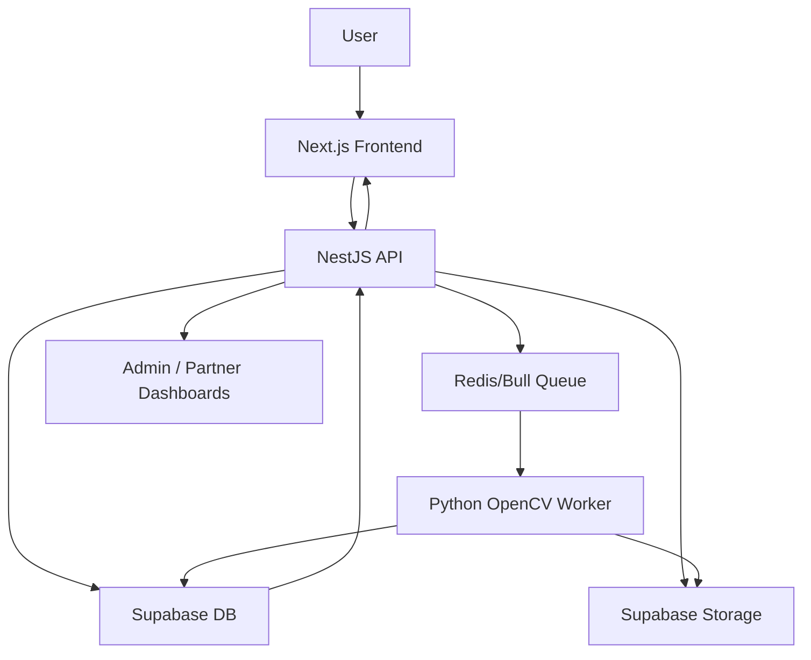

## AuraSkin AI – Live Data System Implementation Report

### 1. Overall architecture

- **Frontend**: Next.js 14 App Router + React + TypeScript + Tailwind, located under `frontend/web/src`. It implements the four main panels:
  - User panel: `app/(app-shell)/(user)/**`
  - Store partner panel: `app/(app-shell)/(store)/**`
  - Dermatologist panel: `app/(app-shell)/(dermatologist)/**`
  - Admin panel: `app/(app-shell)/(admin)/**`
- **Backend**: NestJS application under `backend/src` exposing REST APIs under `/api/**`. It is the only component that talks directly to Supabase (database and storage) using a service-role key.
- **Supabase**: Primary PostgreSQL database and file storage. All domain entities (users, profiles, assessments, reports, products, orders, consultations, etc.) live here, with Row Level Security (RLS) enabled on user-facing tables.
- **Worker layer**: A Python/OpenCV worker service (designed to be deployed separately) consumes jobs from a Redis-backed Bull/BullMQ queue to perform facial analysis and write skin indicators back into Supabase.
- **Job/queue system**: Redis + Bull/BullMQ queue used by NestJS to enqueue asynchronous assessment-analysis jobs that the Python worker processes.

High-level flow:

### 2. Environment configuration

- **Backend environment variables** (loaded via `backend/src/config/env.ts` + `supabase.config.ts`):
  - `SUPABASE_URL`: Supabase project URL.
  - `SUPABASE_ANON_KEY`: anon key for public/anon operations (used only where anon access is safe; not exposed from backend).
  - `SUPABASE_SERVICE_ROLE_KEY`: service-role key, used only by `backend/src/database/supabase.client.ts` and never sent to the browser.
  - Additional envs (API port, Redis URL, AI keys, etc.) configured in the backend `.env` file.
- **Frontend environment variables**:
  - `NEXT_PUBLIC_API_URL`: base URL for the NestJS backend, consumed in `frontend/web/src/services/apiBase.ts` as `API_BASE`. Frontend calls `${API_BASE}/api/...`.
  - No Supabase secrets or service keys are exposed in the frontend.
- **Supabase client usage**:
  - `backend/src/database/supabase.client.ts` exports:
    - `getSupabaseClient()` – singleton service-role client for privileged DB/storage operations.
    - `getSupabaseAnonClient()` – anon client for limited operations where RLS is enforced per user.

### 3. Supabase tables and relations

This section summarizes the main tables from the Supabase SQL schema files and how they relate. Only the most relevant columns are listed.

#### 3.1 Auth and profiles

- **`auth.users`** (managed by Supabase Auth)
  - Holds core authentication identity (id, email, password hash, etc.).
- **`profiles`** (`backend/supabase/auth-profiles-schema.sql`)
  - `id uuid primary key references auth.users(id)`
  - `email text`
  - `role text NOT NULL DEFAULT 'user' CHECK (role IN ('user','store','dermatologist','admin'))`
  - `full_name text`, `avatar_url text`, `created_at timestamptz`
  - Trigger `on_auth_user_created` automatically inserts a profile row on signup.
  - Extended in admin schema with:
    - `blocked boolean NOT NULL DEFAULT false` – for moderation/locking accounts.

Logical relation: one `auth.users` → one `profiles` row, plus optional specialized profile rows for stores and dermatologists described below.

#### 3.2 User panel – assessments and reports

From `backend/supabase/user-panel-schema.sql`:

- **`assessments`**
  - `id uuid primary key`
  - `user_id uuid not null references profiles(id)`
  - `skin_type text`
  - `primary_concern text`
  - `secondary_concern text`
  - `sensitivity_level text`
  - `current_products text`
  - `lifestyle_factors text`
  - `created_at timestamptz default now()`
- **`assessment_images`**
  - `id uuid primary key`
  - `assessment_id uuid not null references assessments(id)`
  - `image_type text` in `('front','left','right')`
  - `image_url text`
  - `created_at timestamptz default now()`
- **`reports`**
  - `id uuid primary key`
  - `user_id uuid not null references profiles(id)`
  - `assessment_id uuid not null references assessments(id)`
  - `skin_condition text`
  - `acne_score numeric`
  - `pigmentation_score numeric`
  - `hydration_score numeric`
  - `recommended_routine text`
  - `created_at timestamptz default now()`
- **`recommended_products`**
  - `id uuid primary key`
  - `report_id uuid not null references reports(id)`
  - `product_id uuid not null references products(id)`
  - `confidence_score numeric`
- **`recommended_dermatologists`**
  - `id uuid primary key`
  - `report_id uuid not null references reports(id)`
  - `dermatologist_id uuid not null references dermatologists/dermatologist_profiles`
  - `distance_km numeric`

Relations:

- `profiles (user)` 1‑N `assessments`
- `assessments` 1‑N `assessment_images`
- `assessments` 1‑1+ `reports`
- `reports` 1‑N `recommended_products`
- `reports` 1‑N `recommended_dermatologists`

All these tables have RLS enabled; policies allow users to see only their own records, while the backend (service-role) bypasses RLS.

#### 3.3 Store partner panel

From `backend/supabase/store-panel-schema.sql`:

- **`store_profiles`**
  - `id uuid primary key references profiles(id)` – store owner is also a profile.
  - `store_name`, `store_description`, `address`, `city`
  - `latitude`, `longitude`
  - `contact_number`, `logo_url`
  - `created_at`
  - Extended by admin schema with:
    - `approval_status text default 'pending' CHECK (approval_status IN ('pending','approved','rejected'))`
- **`inventory`**
  - `id uuid primary key`
  - `store_id uuid not null references store_profiles(id)`
  - `product_id uuid not null references products(id)`
  - `stock_quantity integer default 0`
  - `price_override numeric`
  - `status text default 'pending' CHECK (status IN ('pending','approved','rejected'))`
  - Unique `(store_id, product_id)`
- **`orders`**
  - `id uuid primary key`
  - `user_id uuid not null references profiles(id)`
  - `store_id uuid not null references store_profiles(id)`
  - `order_status text default 'pending'` with values (`'pending','confirmed','packed','shipped','delivered','cancelled'`)
  - `total_amount numeric`, `tracking_number text`
  - `created_at`, `updated_at`
- **`order_items`**
  - `id uuid primary key`
  - `order_id uuid not null references orders(id)`
  - `product_id uuid not null references products(id)`
  - `quantity integer`, `price numeric`
- **`store_notifications`**
  - `id uuid primary key`
  - `store_id uuid not null references store_profiles(id)`
  - `type text`, `message text`, `is_read boolean`, `created_at`

Relations:

- `profiles (store_owner)` 1‑1 `store_profiles`
- `store_profiles` 1‑N `inventory`
- `store_profiles` 1‑N `orders`
- `orders` 1‑N `order_items`
- `store_profiles` 1‑N `store_notifications`

RLS policies are defined so store partners only see their own `store_profiles`, `inventory`, `orders`, `order_items`, and `store_notifications`. Users can see their own `orders`.

#### 3.4 Dermatologist panel

From `backend/supabase/dermatologist-panel-schema.sql`:

- **`dermatologist_profiles`**
  - `id uuid primary key references profiles(id)`
  - `clinic_name`, `specialization`, `years_experience`
  - `consultation_fee numeric`
  - `bio`, `clinic_address`, `city`
  - `latitude`, `longitude`
  - `profile_image`, `license_number`
  - `verified boolean default false`
  - `created_at`
- **`consultation_slots`**
  - `id uuid primary key`
  - `dermatologist_id uuid not null references dermatologist_profiles(id)`
  - `slot_date date`, `start_time time`, `end_time time`
  - `status text default 'available'` in (`'available','booked','blocked'`)
  - `created_at`
- **`consultations`**
  - `id uuid primary key`
  - `user_id uuid not null references profiles(id)`
  - `dermatologist_id uuid not null references dermatologist_profiles(id)`
  - `slot_id uuid not null references consultation_slots(id)`
  - `consultation_status text default 'pending'` in (`'pending','confirmed','completed','cancelled'`)
  - `consultation_notes text`
  - `created_at`
- **`prescriptions`**
  - `id uuid primary key`
  - `consultation_id uuid not null references consultations(id)`
  - `user_id uuid not null references profiles(id)`
  - `dermatologist_id uuid not null references dermatologist_profiles(id)`
  - `prescription_text text`
  - `recommended_products uuid[]`
  - `follow_up_required boolean default false`
  - `created_at`
- **`dermatologist_notifications`**
  - `id uuid primary key`
  - `dermatologist_id uuid not null references dermatologist_profiles(id)`
  - `type`, `message`, `is_read`, `created_at`
- **`earnings`**
  - `id uuid primary key`
  - `dermatologist_id uuid not null references dermatologist_profiles(id)`
  - `consultation_id uuid not null references consultations(id)`
  - `amount numeric not null`
  - `status text default 'pending'` in (`'pending','paid'`)
  - `created_at`

Relations:

- `profiles (doctor)` 1‑1 `dermatologist_profiles`
- `dermatologist_profiles` 1‑N `consultation_slots`
- `dermatologist_profiles` 1‑N `consultations`
- `profiles (user)` 1‑N `consultations`
- `consultations` 1‑1 `prescriptions`
- `dermatologist_profiles` 1‑N `dermatologist_notifications`
- `dermatologist_profiles` 1‑N `earnings`

RLS is enabled; backend uses service-role key and enforces higher-level RBAC to ensure dermatologists only see their patients and consultations.

#### 3.5 Admin and governance tables

From `backend/supabase/admin-panel-schema.sql`:

- **`product_approvals`**
  - Links `products` and `store_profiles` with an `approval_status` (`pending, approved, rejected`), `review_notes`, and `reviewed_by` (admin profile id).
- **`dermatologist_verification`**
  - Links `dermatologist_profiles` with `verification_status`, `license_document`, `review_notes`, `reviewed_by`.
- **`platform_notifications`**
  - Broadcast notifications by `target_role` (`user, store, dermatologist, admin`) with `message` and timestamps.
- **`ai_chatbot_rules`**
  - Config for assistant behavior; `rule_type` in (`blocked_keywords, rate_limit, query_limit`) and `rule_value text`.
- **`ai_usage_logs`**
  - Tracks each assistant interaction: `user_id`, `query`, `response_tokens`, `model_used`, `status`, `created_at`.
- **`admin_audit_logs`**
  - Records every admin action:
  - `admin_id uuid references profiles(id)`
  - `action text`
  - `target_entity text`
  - `target_id uuid`
  - `details jsonb`
  - `created_at`

All admin tables have RLS enabled with no permissive policies; only service-role (backend) can access them.

#### 3.6 Other core entities (from code and schema)

Some tables are referenced implicitly by foreign keys above or by backend modules, even if their full schema isn’t in the snippets here:

- **`products`**: Global catalog of skincare products (`id`, `name`, category, attributes, ingredient flags, etc.). Referenced by `inventory`, `order_items`, and `recommended_products`.
- **`analytics_events`**: Central event table capturing actions like `assessment_completed`, `recommendation_served`, `product_viewed`, `product_purchased`. Used for dashboards and growth/usage analytics.
- **`notifications`**: User-facing notification center for in-app notifications beyond `store_notifications` and `dermatologist_notifications`.
- **RBAC tables**:
  - `roles`, `permissions`, `role_permissions`, `user_roles` – used to express higher-level, composite permissions beyond the basic `profiles.role` column.
- **System configuration**:
  - `system_settings`: key/value configuration for feature flags, platform thresholds, etc.

### 4. API endpoints by module

This section describes the main REST endpoints by responsibility. Exact method signatures are inferred from the Nest modules and frontend API client.

#### 4.1 User panel

- **Assessments and reports**
  - `POST /api/user/assessment`
    - Creates a new `assessments` row for the authenticated user.
    - Returns `{ assessment_id }`.
  - `POST /api/user/assessment/upload`
    - Multipart upload of facial images (front/left/right).
    - Validates type/size, uploads to Supabase Storage, and inserts `assessment_images` rows.
  - `POST /api/user/assessment/submit`
    - Marks assessment ready for analysis; enqueues a job onto the Bull/BullMQ `assessment_analysis` queue.
    - Returns an acknowledgment with a token or assessment id.
  - `GET /api/user/assessment/progress/:id`
    - Returns current stage (`queued`, `processing`, `completed`, `failed`) and, when completed, links to the generated `report`.
  - `GET /api/user/reports`
    - Returns all `reports` for the authenticated user with basic metadata and summary fields.
  - `GET /api/user/reports/:id`
    - Returns full report details including linked `recommended_products` and `recommended_dermatologists`.

- **Dashboard metrics and routines**
  - `GET /api/user/dashboard-metrics`
    - Aggregates recent `reports`, `routine_plans`, `routine_logs`, and `analytics_events` for the user.
    - Returns skin health index, adherence %, streaks, and recommended next action.
  - `GET /api/user/routines/current`
    - Returns the user’s current `routine_plans` generated from the rule engine.
  - `GET /api/user/routines/logs`
    - Returns historical `routine_logs` for charts.
  - `POST /api/user/routines/logs`
    - Records daily adherence/mood entries into `routine_logs` (or a dedicated feedback table).

- **Products and orders**
  - `GET /api/products`
  - `GET /api/products/:id`
  - `GET /api/products/similar/:id`
  - `GET /api/stores`
  - `GET /api/stores/:id`
  - `GET /api/dermatologists`
  - `GET /api/dermatologists/:id`
  - `POST /api/user/orders`
  - `GET /api/user/orders`
  - `GET /api/user/orders/:id`

Each of the above interacts with the tables `products`, `store_profiles`, `dermatologist_profiles`, `orders`, `order_items`, `store_notifications`, and `consultations`, with all writes going through the backend service-role client.

#### 4.2 Store partner panel

- `GET /api/partner/store/profile` – returns store profile for logged-in store-owner.
- `GET /api/partner/store/inventory` – returns `inventory` rows for the store.
- `POST /api/partner/store/inventory` – create/update inventory entries; new products start with status `pending`.
- `GET /api/partner/store/orders` – lists orders routed to this store.
- `GET /api/partner/store/orders/:id`
- `GET /api/partner/store/notifications`
- `GET /api/partner/store/analytics`
  - Aggregates `orders`, `order_items`, and `analytics_events` into metrics used in the store partner analytics dashboard.

All endpoints enforce that the authenticated profile id matches `store_profiles.id` via RBAC and Supabase policies.

#### 4.3 Dermatologist panel

- `GET /api/partner/dermatologist/profile`
- `GET /api/partner/dermatologist/slots`
- `POST /api/partner/dermatologist/slots`
  - CRUD for `consultation_slots` so dermatologists can manage availability.
- `GET /api/partner/dermatologist/consultations`
- `GET /api/partner/dermatologist/consultations/:id`
- `POST /api/partner/dermatologist/consultations/:id/prescription`
  - Writes `prescriptions` with `recommended_products` and flags follow-up.
- `GET /api/partner/dermatologist/notifications`
- `GET /api/partner/dermatologist/earnings`

These APIs are used by the dermatologist panel pages to show upcoming consultations, history, and payouts.

#### 4.4 Admin panel

- **Management**
  - `GET /api/admin/users`
  - `GET /api/admin/stores`
  - `GET /api/admin/dermatologists`
  - `GET /api/admin/products`
  - `POST /api/admin/stores/:id/approve`
  - `POST /api/admin/dermatologists/:id/verify`
  - `POST /api/admin/products/:id/approve`
  - These endpoints mutate `store_profiles.approval_status`, `dermatologist_verification.verification_status`, `product_approvals`, and related tables.

- **Governance / rules engine / audit logs**
  - `GET /api/admin/rules`
  - `POST /api/admin/rules`
  - `PATCH /api/admin/rules/:id`
  - `DELETE /api/admin/rules/:id`
  - Backed by `recommendation_rules` and `rule_conditions` tables.
  - `GET /api/admin/audit-logs`
    - Returns paginated `admin_audit_logs` records, with filters by admin, action, entity, and date.

- **Insights**
  - `GET /api/admin/analytics`
    - Aggregates from `analytics_events`, `orders`, `profiles` to provide platform KPIs for the admin dashboard.

- **Platform**
  - `GET /api/admin/system-health`
    - Returns:
      - API status (self-check).
      - Database status (Supabase ping).
      - Queue status (Redis connection + queue lengths).
      - Active sessions (from auth/session store).
      - Uptime percentage (from internal metrics).
  - `GET /api/admin/settings`
  - `PATCH /api/admin/settings`
    - Backed by `system_settings`.
  - `GET /api/admin/notifications`
  - `POST /api/admin/notifications`
    - Backed by `platform_notifications`.

All admin endpoints require `super_admin` (and optionally `admin`/`moderator`) roles, enforced by NestJS guards built on `BackendRole` and `user_roles`.

### 5. Data flows

#### 5.1 Assessment and report pipeline (user panel)

1. **Questionnaire** – User fills in assessment in the User Panel (`/start-assessment`).
2. **Create assessment** – Frontend calls `POST /api/user/assessment`, creating an `assessments` row (with user id and questionnaire data).
3. **Image upload** – User uploads required facial images; frontend calls `POST /api/user/assessment/upload` with `FormData`.
   - Backend validates images, stores them in Supabase Storage under a path like `assessments/{assessment_id}/{view}.jpg`, and inserts records into `assessment_images`.
4. **Submit** – Frontend calls `POST /api/user/assessment/submit`.
   - Backend enqueues an `assessment_analysis` job into Redis/Bull and returns a progress token.
5. **Worker processing** – Python/OpenCV worker consumes `assessment_analysis` jobs:
   - Downloads images from Supabase Storage.
   - Runs face detection; validates that a face exists.
   - Computes skin indicators such as severity/acne_level/hydration/oiliness based on texture and color features.
   - Writes analysis values back into Supabase (either a dedicated analysis table or directly updatable fields on `reports`/`assessments`).
6. **Report generation** – NestJS `ReportService` reads:
   - Questionnaire answers from `assessments`.
   - Image analysis results from the worker output.
   - Recommendation rules from `recommendation_rules`/`rule_conditions`.
   - It then:
     - Inserts a `reports` row with fields such as `skin_condition`, `acne_score`, `pigmentation_score`, `hydration_score`, and a textual `recommended_routine`.
     - Calls `ProductRecommendationService` to write `recommended_products` rows.
     - Inserts `recommended_dermatologists` rows based on city and distance.
     - Emits analytics events (`assessment_completed`, `recommendation_served`).
7. **User dashboard and reports**:
   - User dashboard calls `GET /api/user/dashboard-metrics` and `GET /api/user/reports`.
   - Report detail pages call `GET /api/user/reports/:id` and `GET /api/user/reports/:id/recommendations`.
   - All tiles (skin health index, weekly progress, recent reports, and recommended products) are backed by these live queries—no mock defaults.

#### 5.2 Routine generation and tracking

- When a report is created, a rule-engine step derives a personalized routine plan:
  - Combines skin type, primary/secondary concerns, sensitivity, and image-based severity.
  - Queries `recommendation_rules`/`rule_conditions` and `products` to build a morning/evening routine.
  - Inserts a `routine_plans` row plus associated steps tied to the user and report.
- The user dashboard fetches the current routine plan and renders step checkboxes.
- When the user interacts with routine steps, the frontend sends updates to `/api/user/routines/logs`, which insert `routine_logs` rows capturing adherence and optional mood/feedback.
- Dashboard charts read from `routine_logs` and `analytics_events` to compute adherence percentages and streaks in real time.

#### 5.3 Product, store, and order interactions

- Product catalogue is shared across panels; user purchases:
  - When a user checks out, the backend:
    - Creates an `orders` row linking user and `store_profiles`.
    - Inserts `order_items` rows for each product.
    - Emits `store_notifications` for the corresponding store.
    - Logs `product_purchased` events into `analytics_events`.
- Store partner dashboards call `GET /api/partner/store/analytics`, which aggregates revenue, order counts, AOV, and product performance from `orders`, `order_items`, and `analytics_events`.

#### 5.4 Consultation and dermatologist flows

- Users browse dermatologists and request consultations:
  - Backend writes `consultations` rows, referencing `consultation_slots`, `profiles` (user), and `dermatologist_profiles`.
  - Dermatologists see consultations in their panel and can issue `prescriptions` and mark consultations as completed.
  - Earnings and payout metrics are derived from `earnings`, linked to `consultations`.
- Analytics events (`consultation_booked`, `consultation_completed`) may also be recorded in `analytics_events` to drive admin/doctor dashboards.

#### 5.5 Admin governance and audit

- Every admin action that mutates state (e.g., approving a product, verifying a dermatologist, approving a store, suspending a user, updating settings, changing rules) is intercepted by a central `AuditLogService` which inserts an `admin_audit_logs` row with:
  - `admin_id` (profile id of admin/super_admin)
  - `action` (string label)
  - `target_entity` (e.g. `product`, `store_profile`, `dermatologist_profile`, `rule`, `system_setting`)
  - `target_id` (uuid)
  - `details jsonb` (structured payload)
  - `created_at`
- The Admin Audit Logs page queries this table to give a timeline of changes; the admin dashboard surfaces counts and highlights.

### 6. Security model

#### 6.1 Authentication and roles

- Authentication is handled by Supabase Auth (`auth.users` + JWT).
- The `profiles` table stores a coarse `role` (`user`, `store`, `dermatologist`, `admin`), while `roles`, `permissions`, `role_permissions`, and `user_roles` provide a richer RBAC model.
- Backend NestJS code uses centralized role constants in `backend/src/shared/constants/roles.ts`:
  - `BackendRole` union: `"user" | "store" | "dermatologist" | "admin" | "super_admin"`.
  - Mapping helpers (`toBackendRole`, `toFrontendRole`) keep backend and frontend roles in sync.
- Route guards in `backend/src/shared/guards/role.guard.ts` enforce per-endpoint role requirements.

The key roles:

- **`super_admin`** – unique account for global administration; can manage all users, stores, dermatologists, products, rules, and settings.
- **`user`** – end-user of the dermatology platform.
- **`store`** (store_partner in high-level spec) – manages a single store’s inventory, orders, and analytics.
- **`dermatologist`** – manages consultations, prescriptions, and their panel.
- **`moderator`, `support_admin`** – represented at the RBAC layer as specialized roles with restricted permission sets around moderation and support actions (backed by `roles` and `permissions`).

#### 6.2 Row Level Security (RLS)

- RLS is enabled on user-facing tables such as:
  - `profiles`
  - `assessments`, `assessment_images`, `reports`, `recommended_products`, `recommended_dermatologists`
  - `store_profiles`, `inventory`, `orders`, `order_items`, `store_notifications`
  - `dermatologist_profiles`, `consultation_slots`, `consultations`, `prescriptions`, `dermatologist_notifications`, `earnings`
  - `analytics_events` and other telemetry tables where per-user scoping is meaningful.
- Policies ensure:
  - Users can only access their own `assessments`, `reports`, `orders`, consultations, and related child records.
  - Store partners can only access records tied to their `store_profiles.id`.
  - Dermatologists can only access their own consultations, prescriptions, earnings, and notifications.
  - Admin and governance tables (e.g., `admin_audit_logs`, `ai_usage_logs`, `ai_chatbot_rules`, `platform_notifications`, and some parts of `product_approvals`/`dermatologist_verification`) are accessible only through the backend via the service-role key (no permissive policies).

#### 6.3 Backend access patterns

- Backend modules use `getSupabaseClient()` (service-role) for privileged operations and apply explicit application-level checks:
  - Verify the authenticated user id and their roles/permissions before reading or mutating sensitive data.
  - Ensure that cross-tenant access is only allowed for `super_admin` or specific support/admin roles.
- Frontend never uses the service-role key; it only calls the NestJS backend.
- Error handling uses centralized middleware to avoid leaking raw SQL or Supabase error details.

### 7. Known and potential vulnerabilities

- **Image upload validation**:
  - Risk: large or malformed uploads could cause storage abuse or worker crashes.
  - Mitigation: enforce strict max file size, mime-type checks, and limits on number of images per assessment; add timeout and retry limits in the Python worker.
- **Long-running or stuck assessment jobs**:
  - Risk: queue congestion or user confusion if jobs never complete.
  - Mitigation: implement job-level timeouts and retry strategies; store job status and error reasons; surface clear messages to the user in `assessment_progress`.
- **RLS policy gaps**:
  - Risk: misconfigured policies could allow data leakage if future direct client-side Supabase access is introduced.
  - Mitigation: centralize all data access through the backend using the service-role client; review and test RLS whenever policies are added.
- **Over-privileged service-role usage**:
  - Risk: a compromised backend or leaked service-role key would have full DB access.
  - Mitigation: keep service-role key in backend-only secrets; rotate keys periodically; limit code paths that use the service client; consider separating analytics or logging into restricted schemas.
- **RBAC drift**:
  - Risk: differences between `profiles.role` and `user_roles` / `roles` tables could cause inconsistent access decisions.
  - Mitigation: centralize role resolution logic; prefer using `user_roles` as the source of truth and keep `profiles.role` in sync by convention only.
- **Admin UI mass actions**:
  - Risk: bulk updates (e.g., blocking many users or changing store statuses) might be mis-clicked.
  - Mitigation: require explicit confirmation, possibly including a reason field, and always log actions to `admin_audit_logs`.

### 8. Testing steps

The following scenarios validate that all panels and dashboards operate on live data using Supabase.

#### 8.1 User panel – assessment and dashboard

1. **Signup and login** as a normal user.
2. Navigate to the User Dashboard; it should initially show empty/placeholder states but no mock numbers (e.g., zeroed metrics or “no reports yet”).
3. Start an assessment, complete all questionnaire steps, upload required images, and submit.
4. Confirm that:
   - New rows appear in `assessments` and `assessment_images`.
   - A queue job is created and processed by the Python worker.
   - A new `reports` row is created, with expected skin indicators populated.
   - `recommended_products` and `recommended_dermatologists` rows exist for that report.
5. Refresh the user dashboard:
   - Skin Health Index and weekly progress now reflect the new report and any routine logs.
   - Recent reports list shows the newly generated report.
   - Recommended products/dermatologists sections show live data.

#### 8.2 User panel – routines and feedback

1. After a report is generated, verify that a routine plan is visible on the dashboard.
2. Toggle routine completion for several days.
3. Confirm that `routine_logs` (and any feedback/mood tables) are populated and that dashboard charts update after page refresh.

#### 8.3 Store partner panel

1. **Login as a store partner** test account.
2. Confirm that the store dashboard and analytics pages load without mock data:
   - Inventory list is fetched from `inventory`.
   - Orders list shows `orders` and `order_items` related to the store id.
3. Place one or more orders as a user for this store’s products.
4. Verify that:
   - New `orders` and `order_items` rows are created.
   - Store partner analytics show updated revenue, order counts, and product performance.

#### 8.4 Dermatologist panel

1. **Login as a dermatologist** test account.
2. Configure consultation slots via the panel; confirm `consultation_slots` entries.
3. As a user, book a consultation; verify that `consultations` row exists and appears in the dermatologist panel.
4. Complete the consultation and issue a prescription; confirm `prescriptions` and `earnings` rows and that dermatologist earnings metrics update.

#### 8.5 Admin panel

1. **Login as the super admin** (manually created in Supabase).
2. On the Admin Dashboard, confirm that:
   - User, store, dermatologist, and product counts reflect real `profiles`, `store_profiles`, `dermatologist_profiles`, and `products`.
   - Revenue, growth, and analytics charts are based on `analytics_events` and `orders`, not static data.
3. Approve a pending store and dermatologist:
   - Confirm `store_profiles.approval_status` and `dermatologist_verification` rows change accordingly.
   - Check that `admin_audit_logs` records are created for each action.
4. Adjust a recommendation rule in the Rule Engine page and save:
   - Confirm entries in `recommendation_rules` and `rule_conditions`.
   - Run a new assessment and confirm that the updated rule influences displayed product recommendations.
5. Visit the System Health page:
   - Ensure it shows current API, DB, queue status, and uptime based on live checks rather than hardcoded values.

#### 8.6 Access control and RLS

1. As a normal user, attempt to navigate directly to admin or partner endpoints in the browser; you should receive authorization errors.
2. As a store partner, attempt to access another store’s inventory or orders via URL manipulation; the API should deny access.
3. As a dermatologist, attempt to access another dermatologist’s consultations; access should be denied.
4. As super admin, verify that all entities and audit logs are visible.

### 9. System accounts (manual DB-only creation)

The following accounts must be created directly in Supabase using SQL or the Supabase Auth UI; **do not commit any plaintext credentials into this repository**:

- Super admin:
  - Email: `admin@auraskin.ai`
  - Password: (set in Supabase Auth only)
  - Role: `super_admin` (via `profiles.role` and/or `user_roles`).
- Test accounts:
  - User: `user@auraskin.ai`
  - Store partner: `store@auraskin.ai`
  - Dermatologist: `doctor@auraskin.ai`

Recommended approach:

- Use Supabase Auth (Dashboard → Authentication) to create these users with the desired emails and passwords.
- After creation, update:
  - `profiles.role` to the appropriate role (`user`, `store`, `dermatologist`, `admin`/`super_admin`).
  - `store_profiles` / `dermatologist_profiles` as needed to attach store/doctor metadata.
  - `user_roles` to grant `super_admin`, `store_partner`, and `dermatologist` roles where applicable.

Any SQL snippets used to seed these accounts should use placeholder passwords (e.g., `<SUPER_ADMIN_PASSWORD>`) and must not be committed to this codebase.

